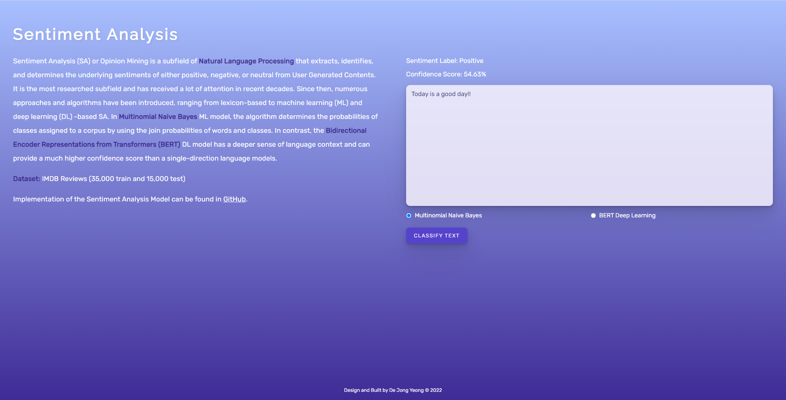

# NLP Web App: Sentiment Analysis



Analyse and predict the sentiment of user defined inputs using Python Django, ReactJS and APIs.

_P.S: This is an extension/improvement/additional features of my Bachelor Degree Final Year Project: [Sentiment Analysis Approach for Reputation Evaluation](https://github.com/dejongyeong/sentiment-analysis). This iteration uses TensorFlow and some pre-processing methods, e.g., html tags cleaning, to lowercase, digits removal, expand contractions, etc. before model training._

### **Technology**

- Python 3.9
- Django REST Framework
- ReactJS + ESLint AirBnB + Prettier
- GitGuardian for Git Security Scanning & Secrets Detection

### **Recommendations**

- Setup **Python Virtual Environments** before installing dependency packages: [Tutorial](https://docs.python.org/3.9/library/venv.html)

### **References**

- Jordan Irabor: [How to Build a To-Do Application Using Django and React](https://www.digitalocean.com/community/tutorials/build-a-to-do-application-using-django-and-react)
- Rahul Agarwal: [Text Preprocessing Methods for Deep Learning](https://towardsdatascience.com/nlp-learning-series-part-1-text-preprocessing-methods-for-deep-learning-20085601684b)
- Mahdyar Hasanpour: [Resolve ansi-html vulnerability](https://github.com/Tjatse/ansi-html/issues/19#issuecomment-936734884)
- AskPython: [Python Django App Structure and Project Structure](https://www.askpython.com/django/django-app-structure-project-structure)
- Rani Horev: [BERT Explained: Start of the art language model for NLP](https://towardsdatascience.com/bert-explained-state-of-the-art-language-model-for-nlp-f8b21a9b6270)


### **Steps to Reproduce**
*Unable to deploy this application to Heroku as it contains large model files without AWS Static Storage services and encoutered error ```503``` while trying to deploy it to Heroku.*

**Prerequisite:** ```tensorflow```, ```npm```, and ```python``` were installed and are ready-to-use.

**Step 1:** Install the require packages using ```pip install -r requirements.txt```.

**Step 2:** Environment File
- Visit [Djecrety](https://djecrety.ir/) to generate a Django Secret Key.
- Create an ```.env``` file in ```server\``` main folder and add ```SECRET_KEY=[replace with the generated key]```.

**Step 3:** Install NPM modules using ```npm install``` inside the ```nlp-client``` folder.

**Step 4:** Initiate Django server using ```py .\server\manage.py runserver```, assuming that you are in the root directory.

**Step 5:** Start React App using ```npm run start``` and visit ```locahost:[port number]``` on your browser.

**Voila!** You can now start classify a statement into either positive or negative sentiment!!.


